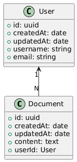

# Markdown Editor

The end goal is to have an application that supports creating, editing, deleting markdown documents in the browser.

## User Flow

- User enters the application
- Creates a new document
- Edits the content of the document
- Provides a name to the document
- Saves the document
- Can delete documents not required

## Key entities identified

- User - that performs the operation
- Markdown Document - stores the actual content itself

## Class diagram

## High-Level component structure

- Header - Display information of the document
- Editor - to edit content
- Preview - to preview the content
- Sidebar - to manage application state

## Defining the application state

We utilize the `useContext` API to define the context at this initial stage along with the `useReducer` API to consolidate the various actions that are to be performed within the application.

The following contexts are defined at the application level at this stage:

- AppContext - to store the current state
- AppDispatchContext - to hold the reducers/actions that are defined at the root level to be passed to the components.

The use of **context** prevents **prop drilling**, which can become cumbersome as the application grows.
